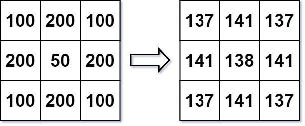

# Algo implementations
- **Lists**
  * [Sum Pairs](lists/array_sum_pairs.py): 
    *Within a list of integers, find matches for target number. Each integer may appear only once in a pair.*
  * [Fibonacci sequence](lists/fibonacci.py):
    *Given a number n, return first n elements from a fibonacci sequence.*
  * [Balanced Parentheses](lists/balanced_parentheses.py):
    *Given a string of opening and closing parentheses, check whether it’s balanced.* 
  * [List difference](lists/find-missing-element.py):
    *Given array of integers and same array minus one element, find which is missing in the second array.* 
  * [Largest Continuous Sum](lists/largest-continuous-sum.py):
    *Given an array of integers (positive and negative), find the largest continuous sum.* 
  * [Next higher number](lists/next-higher-number-with-same-digits.py):
    *Given a number, find the next higher number using only the digits in the given number.*
  * [Second smallest number](lists/second_smallest-in-array.py):
    *Given an array of integers, find the smallest and second smallest element.*
  * [All permutations of a string charset](lists/all-permutations-of-string.py):
    *Generate all possible permutations of a given string.*
  * [Max rectangle area](lists/max_rectangle.rb):
    *Given an array of integers (histogram bars), return the area of the largest rectangle.*
    
  * [Product Except Self](lists/product_except_self.rb):
    Return an product array of all the elements of nums except nums[i]  
  * [First Missing Positive Integer](lists/first_missing_positive_integer.rb):
    find the lowest positive integer that does not exist in the array.  
  * [merge multiple sorted lists](lists/merge_sorted_lists.py):
    Traverse multiple sorted arrays at once with *heapq* and _while_.  
  * [seesaw / wave sort](lists/sort_in_waves.rb)
    Sort array in place such as lower value follows a higher value which is then followed by a higher value again.
- **Strings**
  * [FizzBuzz](strings/fizzbuzz.py): 
    *Classics. For multiples of 3 print "Fizz"; for multiples of 5 print "Buzz". Combine for both.*
  * [RLE (Simple Lossless Compression)](strings/rle.py):
    *Count consecutive characters in a string.* 
  * [Sequential column names](strings/increment_excel_columns.py):
    *Given sequennce of characters, return next in alphabetic order.* 
- **Matrix**
  * [Island perimeter](matrix/island_perimeter.rb): 
    *Land and water on an x/y map. Determine the perimeter of land surface.*
    
  * [Image smoother](matrix/image_smoother.rb): 
    *Given 0-255 grayscale values in a matrix, blur the image using neighboring cell values.*
    
- **SQL**
  * [Star Schema](http://htmlpreview.github.io/?https://github.com/Kartoshka548/algos/blob/master/sql/sql-star-schema-EDB.html)
    *Find out insights of Employee fact table, Department and Bonus dimensions.*
  * [Cumulative values](http://htmlpreview.github.io/?https://github.com/Kartoshka548/algos/blob/master/sql/cumulative-values.html)
    *Each row below will be added to a value above*
- **Recursive**
  * [Best place to rent](recursive/minimum_farthest_distance.rb)
  *Minimize the farthest distance we would have to walk*
  * [Number of ways to decode data](recursive/number_of_ways_to_decode_data.rb)
  *11121 and a=1,b=2, ... z=26*
  * [Find correct lock password using char list](recursive/variable_length_password_generator.rb)
  *Generate the actual passcode with minimum tries*  
- **Dynamic Programming**
  * [Implement missing methods](dynamic_programming/enclosed_itemgetter_methods.py)
  *Enclosed (wrapped) functions with memoization*
  * [Intern interviews](dynamic_programming/interview_practice_valerochka.py)
  *Random logical riddles and puzzles for the whole family*
  
#### Tree:
```
├── README.md
├── bfs
│   └── racecar.rb
├── binary_search
│   └── koko_eating_bananas.rb
├── cyclic_sort
│   └── find_duplicates_in_array.rb
├── dynamic_programming
│   ├── car_pooling.rb
│   ├── coin_change_bottom_up.rb
│   ├── coin_change_top_down.rb
│   ├── enclosed_itemgetter_methods.py
│   ├── encrypt_message_roblox_p2.rb
│   ├── find_duplicates_in_array.rb
│   ├── find_words_in_stream.rb
│   ├── flip_doors.rb
│   ├── gas_stations.rb
│   ├── integer_to_roman.rb
│   ├── interview_practice_valerochka.py
│   ├── kth_permutation.py
│   ├── kth_permutation.rb
│   ├── maximum_profit_in_job_scheduling.rb
│   ├── median_finder.rb
│   ├── perfect_squares.rb
│   ├── playing_cards_and_csv_converter.rb
│   └── sliding_window.md
├── lists
│   ├── all-permutations-of-string.py
│   ├── array_sum_pairs.py
│   ├── balanced_parentheses.py
│   ├── bubble_sort.py
│   ├── fibonacci.py
│   ├── find-missing-element.py
│   ├── first_missing_positive_from_unsorted_array.rb
│   ├── first_missing_positive_integer.rb
│   ├── largest-continuous-sum.py
│   ├── max_rectangle.rb
│   ├── merge_sorted_lists.py
│   ├── move_zeroes_to_end_of_array.rb
│   ├── next-higher-number-with-same-digits.py
│   ├── next_greater_element_two_arrays_using_stack.rb
│   ├── product_except_self.rb
│   ├── range_addition.rb
│   ├── remove_nth_node_from_end_of_list.rb
│   ├── second_smallest-in-array.py
│   ├── sort_in_waves.rb
│   ├── sum_two_linked_list_nodes.rb
│   └── toggle_doors.rb
├── matrix
│   ├── count_all_submatrices.rb
│   ├── count_islands.rb
│   ├── encrypt_message_roblox_p1.rb
│   ├── image_smoother.rb
│   ├── island_coordinates.rb
│   ├── island_perimeter.rb
│   ├── rotate.rb
│   └── maximal_rectangle.rb
├── recursive
│   ├── max_coins.rb
│   ├── minimum_farthest_distance.rb
│   ├── number_of_ways_to_decode_data.rb
│   └── variable_length_password_generator.rb
├── sql
│   ├── cumulative-values.html
│   └── sql-star-schema-EDB.html
├── strings
│   ├── fizzbuzz.py
│   ├── increment_excel_columns.py
│   └── rle.py
└── two_pointers
    ├── fast_slow_tortoise_and_hare
    │   ├── find_duplicate_in_array.rb
    │   └── squares_of_digits_cycle.rb
    └── trapping_rain_water.rb
```
